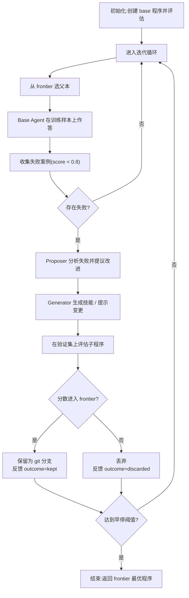

# EvoSkill 指南:架构、打分与扩展

> 本文档合并整理 EvoSkill 的整体架构、打分子系统(重点)与扩展方法,基于当前代码(截至 2026-08)。
> 官方英文文档见 [`architecture.md`](./architecture.md)、[`evaluation.md`](./evaluation.md)。

---

# 第一部分:整体架构

## 1.1 项目定位

EvoSkill 是一个「自改进编码 Agent 技能发现」框架,是 [GEPA](https://github.com/sentient-agi/gepa-plus) 的进化版。

- **GEPA**:针对单个文件(prompt)做原地修订。
- **EvoSkill**:把进化单位从「单个文件」升级为「完整的 agent 程序」——同时提议技能(skill)与提示词(prompt)的变更,在留出数据上评估,每轮迭代产出一个全新的 agent 程序。

目标:让一个通用 agent 通过「基准测试驱动 + 反馈循环」自动演化出技能与提示词,收敛成更强的专用 agent,且技能可跨 agent、跨模型、跨任务迁移复用。

## 1.2 核心进化循环(五阶段)

核心引擎是 `src/loop/runner.py` 中的 `SelfImprovingLoop`。

```
1. Base Agent    用当前最优程序(系统提示 + 技能集)在训练样本上作答
2. Proposer      分析失败案例,提出技能或提示词的改进方向
3. Generator     实际产出变更(写新 SKILL.md,或重写系统提示)
4. Evaluator     在留出的验证集上打分,衡量是否提升
5. Frontier      用 git 分支记录 top-N 程序,最优者进入下一轮
```

一次迭代的完整流程:

1. **选父本** — 从 frontier 中按策略(默认最优)挑选一个程序作为父本。
2. **找失败** — 用父本在训练样本上作答,收集得分低于阈值(0.8)的失败案例。
3. **提议** — Proposer 读取失败 trace + 历史反馈,输出结构化提议(`action` / `target_skill` / `proposed` / `justification`)。
4. **生成** — Generator 落笔:新建或编辑技能文件,或重写系统提示。
5. **评估** — 在验证集上对子程序打分。
6. **保留/丢弃** — 得分进入 frontier 则保留(记为 git 分支),否则丢弃并记录反馈。
7. **早停** — 连续 `no_improvement_limit` 轮无提升则停止。

训练集用于「找失败」,验证集用于「测提升」,两者分离防止 agent 过拟合具体题目。

## 1.3 进化的对象:Agent 程序(Program)

进化的最小单位是 **Program**,由 `src/registry/models.py` 的 `ProgramConfig` 定义:

| 字段 | 含义 |
|------|------|
| `name` | 程序名(用于分支命名) |
| `parent` | 父程序分支(如 `program/base`) |
| `generation` | 距基线的变异代数 |
| `system_prompt` | 系统提示词配置 |
| `allowed_tools` | 允许使用的工具列表 |
| `output_format` | 输出格式(JSON schema) |
| `metadata` | 元数据(score、时间戳等) |

技能(skills)以 `.claude/skills/<skill>/SKILL.md` 文件夹形式存在,随 git 分支一并版本化。每次迭代通过 `mutate()` 从父程序派生一个子程序,对应一个新 git 分支。

### 两类可变对象

对应 `evolution.mode`:

| 模式 | 进化对象 | 载体 |
|------|---------|------|
| `skill_only` | 技能 | 新增/编辑 `.claude/skills/<skill>/SKILL.md` |
| `prompt_only` | 系统提示词 | 重写 `src/agent_profiles/base_agent/prompt.txt` |

> 注:README 提到「jointly propose skill and prompt mutations」,但当前代码里 `evolution_mode` 是二选一,联合进化尚未实现。

## 1.4 分层架构

```
src/
├── cli/          命令行入口 (click): init/run/eval/diff/logs/reset/remote
├── api/          高级 Python API: EvoSkill, EvalRunner
├── loop/         核心进化循环 (runner.py + config + helpers)
├── harness/      多 Agent SDK 适配层 —— 统一接口,屏蔽差异
│   ├── claude/ opencode/ openhands/ codex/ goose/ harbor/
├── registry/     程序版本管理 (git 分支, ProgramConfig/ProgramManager)
├── schemas/      结构化输出 Pydantic 模型 (AgentResponse, ProposerResponse…)
├── agent_profiles/  各类 agent 的 prompt 模板 (base/proposer/skill_generator…)
├── evaluation/   评分器 (multi_tolerance/exact/llm/script/harbor)
├── cache/        运行缓存
├── remote/       远程执行 (Daytona)
└── docker/       Docker 执行
```

各层职责:

- **CLI / API 层**:入口,组装配置、触发循环、展示进度表。
- **Loop 层**:进化算法本体,串联五个阶段、维护 frontier 与反馈历史。
- **Harness 层**:把不同 agent SDK 封装成统一的 `Agent[T]` / `AgentTrace[T]` 接口。
- **Registry 层**:用 git 分支管理程序版本,提供 frontier 的增删查与选择策略。
- **Schemas 层**:定义各 agent 角色的结构化输出契约,驱动 proposer/generator 的返回值。
- **Agent profiles 层**:定义每个 agent 角色的系统提示、工具、输出 schema。
- **Evaluation 层**:回答正确性评分。

## 1.5 关键设计点

### 5.1 SDK 无关的 Agent 抽象(`src/harness/agent.py`)

- `Agent[T]` 泛型包装器,`AgentTrace[T]` 是统一的运行结果结构。
- 通过全局 `get_sdk()` 动态分派到具体 executor,下游无需感知具体 SDK。
- 内置重试(指数退避 30s→60s→120s)、20 分钟超时、结构化输出校验。

### 5.2 Git 作为版本系统(`src/registry/`)

- 每个程序 = 一个 `program/*` git 分支,配置存 `.claude/program.yaml`。
- 只写 `program/` 前缀分支,绝不触碰用户代码。

### 5.3 结构化输出驱动(`src/schemas/`)

- Proposer/Generator 通过 Pydantic 模型返回结构化结果。
- 各 SDK 支持不一:OpenHands 用 JSON 提取 fallback;OpenCode 需 v1.4.0+。

### 5.4 多 Agent 多模型兼容(`src/harness/`)

支持六种运行时:Claude Code、Codex、OpenCode、OpenHands、Goose、Harbor。

### 5.5 三种执行模式

Local(直接)/ Docker(容器)/ Daytona(托管云沙箱)。

## 1.6 流程图



---

# 第二部分:打分子系统(重点)

打分是进化循环的「裁判」:把 agent 输出与标准答案对比,产出 0~1 分数,决定程序是否进入 frontier。

## 2.1 打分在进化循环中的位置

调用链:

```
config.toml [scorer] type ──► make_scorer(cfg)         (src/cli/shared.py:185)
                                   │
                                   ▼
SelfImprovingLoop._evaluate()       (src/loop/runner.py:446)
  ├─ evaluate_agent_parallel(...)  并发跑 agent 得到 trace
  └─ self.scorer(question, final_answer, ground_truth) 逐题打分,平均 = 程序分
```

## 2.2 打分在什么步骤执行

打分在进化循环里出现在**两个时机**,共用同一个 `self.scorer`:

### 时机 1:训练阶段 —— 找失败(每次迭代)

位置:`SelfImprovingLoop.run()` 主循环,`src/loop/runner.py:314-324`。

```python
avg_score = self.scorer(question, agent_answer, answer)   # 0~1
status = "[OK]" if avg_score >= 0.8 else "[FAIL]"
if avg_score < 0.8:
    failures.append(...)   # 失败案例 → 喂给 Proposer
```

**目的**:二分类,用 `0.8` 阈值筛出答错的样本,作为 Proposer 分析「哪里不行」的素材。这是 **Base Agent 阶段**的收尾动作。

### 时机 2:验证阶段 —— 评估程序(算准确率)

位置:`_evaluate()`,`src/loop/runner.py:446-472`。对验证集逐题打分后取平均:

```python
score += self.scorer(result.question, result.trace.output.final_answer, result.ground_truth)
return score / len(results)   # 程序准确率
```

`_evaluate` 被两处调用:

| 调用点 | 位置 | 作用 |
|--------|------|------|
| `_ensure_base_program()` | `runner.py:436` | 首次给 base 程序打分,加入 frontier |
| `run()` 主循环 | `runner.py:349` | 变异出子程序后打分,决定进 frontier 还是丢弃 |

这是 **Evaluator 阶段**。

### 时间线

```
每次迭代:
  ① 选父本 ──► ② 训练样本上跑 agent ──► ③ 打分(时机1,找失败)
  ──► ④ Proposer/Generator 变异 ──► ⑤ 验证集打分(时机2,算分数)
  ──► ⑥ 进 frontier 或丢弃
```

## 2.3 Scorer 工厂与 5 种内置类型

`make_scorer(cfg)`(`src/cli/shared.py:185`)按 `config.toml` 的 `[scorer] type` 分派。类型由 `ScorerConfig`(`src/cli/config.py:88`)定义:

| type | 说明 | 配套字段 |
|------|------|---------|
| `multi_tolerance`(默认) | 多容差加权模糊匹配 | — |
| `exact` | 大小写不敏感的字符串全等 | — |
| `llm` | LLM 当裁判,按 rubric 打分 | `rubric` / `model` / `provider` |
| `script` | 外部 shell 脚本 | `command` |
| `harbor` | 解 Harbor 容器的 reward JSON | — |

### Scorer 场景、输入与示例

scorer 的输入统一是「问题 + 预测答案 + 标准答案」三个字符串(个别例外),区别在于**场景**和**怎么比**。

| scorer | 场景 | 输入签名 |
|--------|------|---------|
| `multi_tolerance` | 通用数值问答(带单位/容差) | `(question, predicted, ground_truth)` |
| `exact` | 答案需完全一致 | `(question, predicted, ground_truth)` |
| `llm` | 语义/开放问答 | `(question, predicted, ground_truth)` |
| `script` | 自定义复杂判定 | `(question, predicted, ground_truth)` |
| `harbor` | 容器化 benchmark | `(question, predicted, ground_truth)` |
| `sealqa` | SEAL-QA 多跳问答 | `(question, ground_truth, predicted)` ⚠️ 顺序不同 |
| `dabstep` | 表格问答 | `(input1, input2)` ⚠️ 仅两个参数 |
| `livecodebench` | 代码生成(跑测试) | `(question, ground_truth, predicted)` |

**multi_tolerance(默认)** — 数值问答,答案常带数量级单位或需容忍小误差。

```
question     = "What was revenue in Q3?"
ground_truth = "4.2 billion"
predicted    = "$4.2B"          → 数字 4.2 命中、单位 billion 命中 → 1.0
predicted    = "4.19 billion"   → 1% 容差内 → 0.70
predicted    = "4.5 billion"    → 超出 10% → 0.0
```

**exact** — 答案必须一字不差(大小写不敏感)。

```
ground_truth = "Paris"
predicted    = "paris"          → 1.0
predicted    = "Paris, France"  → 0.0
```

**llm** — 语义/开放答案,用模型按 `rubric` 打分。

```
rubric       = "Award 1.0 if the answer is semantically correct, else 0.0"
question     = "What city is OpenAI headquartered in?"
ground_truth = "San Francisco, California"
predicted    = "San Francisco"  → LLM 判正确 → 1.0
```

**script** — 需跑代码/调外部工具,通过 `{predicted}`/`{expected}` 占位符传入。

```toml
[scorer]
type = "script"
command = "python score.py --predicted {predicted} --expected {expected}"
```

**harbor** — 容器化 benchmark,`predicted` 是 JSON 信封,`ground_truth` 被忽略。

```
predicted = '{"reward": 0.85, "metric": "reward.txt", "exit_status": "verified"}'
→ json.loads 解出 reward → 0.85
```

**sealqa** — SEAL-QA 多跳问答,`dspy` + LLM 判 CORRECT/INCORRECT/NOT_ATTEMPTED。⚠️ 顺序 `(question, ground_truth, predicted)`。

```
question     = "What are the names of Barack Obama's children?"
ground_truth = "Malia and Sasha"
predicted    = "sasha and malia obama"   → CORRECT → 1.0
```

**dabstep** — 表格问答,处理千分位逗号数字、列表、文本。⚠️ 仅 `(input1, input2)`。

```python
question_scorer("1,000,000", "1000000")   # 去逗号比较 → True
question_scorer("[a, b, c]", "[c, b, a]") # 列表排序后相等 → True
question_scorer("United States", "USA")   # SequenceMatcher < 0.95 → False
```

**livecodebench** — 代码生成,在容器跑代码看测试是否通过。

```
predicted    = "```python\ndef add(a,b): return a+b\n```"
ground_truth = '[{"input":"1,2","output":"3"}]'
→ 跑代码,stdout "3" 匹配 → 1.0
```

**选型速查**:数值/单位 → `multi_tolerance`;必须一致 → `exact`;语义开放 → `llm`;特殊逻辑 → `script`;表格数字/列表 → `dabstep`;容器 verifier → `harbor`。

## 2.4 核心算法:reward.py 模糊匹配

文件 `src/evaluation/reward.py`,是 `multi_tolerance` 与 `exact` 之外的通用引擎,处理「数字 + 单位 + 文本」混合答案。入口 `score_answer(gt, pred, tolerance)` → `fuzzy_match_answer(...)`,返回 0 或 1。

流水线工具函数:

| 函数 | 作用 |
|------|------|
| `normalize_text` | 统一 Unicode 减号(`−`→`-`) |
| `extract_numbers_with_context` | 正则 `-?\d+\.?\d*%?` 提取数字 + 前后 20 字符上下文,标记是否百分比/负数 |
| `detect_unit_in_context` | 识别数量级单位:trillion/billion(`b`)/million(`m`)/thousand(`k`) |
| `normalize_number_with_units` | 返回「基数 + 单位名」,**不做乘法**。`"543 million"` → base `543` |
| `is_likely_year` | 判断 `1900 <= n <= 2100` 且为整数,过滤预测里偶然出现的年份 |
| `has_significant_text` | 去掉数字/单位后是否还剩有意义文本(处理 `"March 1977"` 混合答案) |
| `check_text_overlap` | 检查文本部分是否重叠(防止「数字对但月份错」) |
| `extract_final_answer` | 提取 `<FINAL_ANSWER>...</FINAL_ANSWER>` 标签内容 |

`fuzzy_match_answer` 主逻辑两大分支:

- **Case 1:双方都有数字**
  - GT 单数字:遍历预测数字,算 `diff_pct = |gt-pred|/|gt|`,找 `diff_pct <= tolerance` 的最优匹配;命中后做 `check_text_overlap`;必要时过滤年份数字。
  - GT 多数字(列表):**每个 GT 数字**都要在预测里找到容差内匹配(全有才过),并做文本重叠校验。
  - GT 为 0 时只接受 pred 也为 0。
- **Case 2:纯文本** — 去括号、strip 引号、小写后,做「GT 是 pred 子串」或全等匹配(日期/文本要求精确匹配)。

## 2.5 multi_tolerance 聚合:0/1 → 连续分

`_score_multi_tolerance`(`src/loop/runner.py:29`)在 5 个容差级别上分别打分再加权:

```python
TOLERANCE_LEVELS = [0.05, 0.01, 0.1, 0.0, 0.025]
weight = 1.0 / (1.0 + 20.0 * tol)   # 越严格(tol 越小)权重越高
```

| tol | 权重 | 语义 |
|-----|------|------|
| 0.0 | 1.000 | 精确匹配,权重最高 |
| 0.01 | 0.833 | 1% 容差 |
| 0.025 | 0.667 | 2.5% 容差 |
| 0.05 | 0.500 | 5% 容差 |
| 0.10 | 0.333 | 10% 容差,权重最低 |

加权平均得连续分:精确匹配 = 1.0,误差越大分越低。

## 2.6 并行评估与缓存

`evaluate_agent_parallel`(`src/evaluation/evaluate.py`):
- `asyncio.Semaphore(max_concurrent)` 限制并发
- 每题 17 分钟硬超时(1020s)
- 可选 `RunCache`(按 git tree hash 缓存,技能没变就不重跑)
- 超时/异常 → `trace=None` → 该题按 0 分处理

`evaluate_full`(`src/evaluation/eval_full.py`)是「全量评估」版本:带数据集 index、pkl 增量落盘、`resume` 断点续跑(重跑失败、跳过成功)。

## 2.7 任务特定评分器

| 文件 | 用途 | 机制 |
|------|------|------|
| `sealqa_scorer.py` | SEAL-QA 开放问答 | `dspy` + LLM 语义裁判,判 CORRECT/INCORRECT/NOT_ATTEMPTED,带 few-shot 示例 |
| `harbor_scorer.py` | Harbor 容器任务 | `json.loads(predicted)` 解 `{"reward": 1.0, ...}`,取 reward(忽略 GT) |
| `dabstep_scorer.py` | DABstep 表格问答 | 处理千分位逗号数字、列表(`;`/`,`)、`SequenceMatcher>0.95` 模糊文本 |
| `livecodebench_scorer.py` | LiveCodeBench | 容器运行生成代码、检查测试是否通过 |

## 2.8 打分方式是否固定

**不固定,高度可配置、可扩展**,分三档:

1. **内置 5 种类型**:`config.toml` 的 `[scorer] type` 切换。
2. **用户自定义(不改代码)**:
   - `script` 类型:写任意脚本,接收 `{predicted}` / `{expected}` 变量,输出数字。
   - `llm` 类型:自定义 `rubric`(评分标准)。
3. **Python API 注入任意函数**:
   - `SelfImprovingLoop(scorer=...)` 接受任意 `Callable[[question, predicted, ground_truth], float]`(`runner.py:122`)。
   - `TaskConfig.scorer: ScorerFn | None`(`src/api/task_registry.py:26`)可为任务绑定专属打分器。

> 固定的是「函数签名」`(question, predicted, ground_truth) -> float`;不固定的是「怎么算分」。

## 2.9 深入分析

### 2.9.1 multi_tolerance 阈值 0.8 的实际效果

`score_answer` 底层是**二值**(返回 0 或 1),`_score_multi_tolerance` 只是对 5 个二值结果加权平均。因此对给定误差 `diff`,得分只落在少数几个离散值上(总权重 3.333):

| 误差 diff | 匹配的 tol | 得分 |
|-----------|-----------|------|
| = 0(精确) | 全部 5 个 | **1.000** |
| (0, 1%] | 0.01/0.025/0.05/0.1 | 0.700 |
| (1%, 2.5%] | 0.025/0.05/0.1 | 0.450 |
| (2.5%, 5%] | 0.05/0.1 | 0.250 |
| (5%, 10%] | 0.1 | 0.100 |
| > 10% | 无 | 0.000 |

**关键结论**:runner 里用 `>= 0.8` 判「通过」,而默认 `multi_tolerance` 下非精确匹配最高只得 0.7。**因此在默认配置下,「通过」实际等效于「精确匹配」**——任何 1% 以内的偏差都会判为失败。

这带来两个影响:
1. 若你希望「近似答案也算对」,要么调低阈值(如 0.45 对应 2.5% 容差),要么改用 `llm`/`script` 产出真正的连续分。
2. 「越严格权重越高」的加权设计,在阈值判定下被二值化,其主要价值体现在**连续分排序**(frontier 成员间的精细比较)而非失败判定。

### 2.9.2 训练 / 验证共用同一 scorer 的一致性

两个打分时机(找失败、评估)用的是**同一个 `self.scorer`**。这保证「发现失败的标准」与「衡量进步的标准」一致——否则会出现「按 A 标准找失败、按 B 标准评估」的错位,导致 Proposer 优化的方向与最终评估脱节。

### 2.9.3 reward.py 的设计权衡

- **单位不做乘法**:`"543 million"` 归一化为 base `543` 而非 `543000000`,因此 `"543"` 与 `"543 million"` 判相等、与 `"543000000"` 判不等。这是**刻意要求单位词双方一致**,避免「数值巧合相等但量级错」的假阳性。
- **年份过滤**:预测里常混入「reported in 2023」这类与答案无关的年份,需过滤;但 GT 本身是年份(如 `"2003"`)或混合(`"March 1977"`)时不能过滤,故用 `is_likely_year` + `has_significant_text` 联合判断。
- **列表全匹配**:多数字答案要求「每个 GT 数字都命中」,避免部分命中就判对。

### 2.9.4 连续分 vs 二值分

- `multi_tolerance` 产出的是**伪连续分**(若干离散档位),本质仍是精确匹配的软化。
- `llm` / `script` 可产出**真正连续**的 0~1 分,粒度更细,适合需要按「接近程度」排序的场景。
- 连续分的粒度会直接影响 frontier 排序与早停判断:若大多数程序都落在同一离散档位,排序退化为并列,进化信号变弱。

### 2.10 常见 Scorer 源码

以下源码均从仓库现行代码中摘录,作为 2.1~2.9 分析的对照。每个片段标注来源文件,便于跳转核对。

#### 2.10.1 `make_scorer` 工厂(`src/cli/shared.py:185`)

五种 scorer 类型在此分发。默认兜底回落到 `_score_multi_tolerance`。

```python
def make_scorer(cfg: ProjectConfig):
    from src.loop.runner import _score_multi_tolerance

    if cfg.scorer.type == "harbor":
        from src.evaluation.harbor_scorer import harbor_reward_scorer
        return harbor_reward_scorer

    if cfg.scorer.type == "exact":

        def exact(question: str, predicted: str, ground_truth: str) -> float:
            return (
                1.0
                if str(predicted).strip().lower()
                == str(ground_truth).strip().lower()
                else 0.0
            )

        return exact

    if cfg.scorer.type == "multi_tolerance":
        return _score_multi_tolerance

    if cfg.scorer.type == "llm":
        rubric = cfg.scorer.rubric or "Award 1.0 if correct, 0.0 if wrong."
        model = cfg.scorer.model or "claude-sonnet-4-6"
        provider = cfg.scorer.provider or infer_provider(model)

        async def llm_score(question: str, predicted: str, ground_truth: str) -> float:
            prompt = (
                f"Question: {question}\n"
                f"Expected: {ground_truth}\n"
                f"Got: {predicted}\n\n"
                f"Rubric: {rubric}\n\n"
                "Reply with only a number between 0.0 and 1.0."
            )
            try:
                text = await call_llm(provider, model, prompt)
                return float(text.strip())
            except ValueError:
                import logging
                logging.getLogger(__name__).warning(
                    "LLM scorer: could not parse response as float: %r", text
                )
                return 0.0
            except Exception as exc:
                import logging
                logging.getLogger(__name__).error(
                    "LLM scorer failed (%s: %s) — returning 0.0",
                    type(exc).__name__, exc,
                )
                return 0.0

        def llm_scorer(question: str, predicted: str, ground_truth: str) -> float:
            coro = llm_score(question, predicted, ground_truth)
            try:
                asyncio.get_running_loop()
            except RuntimeError:
                return asyncio.run(coro)
            else:
                import concurrent.futures
                with concurrent.futures.ThreadPoolExecutor(max_workers=1) as pool:
                    return pool.submit(asyncio.run, coro).result()

        return llm_scorer

    if cfg.scorer.type == "script":
        import shlex
        import subprocess

        if not cfg.scorer.command:
            raise ValueError(
                "scorer.type is 'script' but scorer.command is not set in config.toml"
            )

        def script_scorer(question: str, predicted: str, ground_truth: str) -> float:
            cmd = cfg.scorer.command.replace("{predicted}", predicted).replace("{expected}", ground_truth)
            try:
                result = subprocess.run(
                    shlex.split(cmd), capture_output=True, text=True, timeout=30,
                )
            except subprocess.TimeoutExpired:
                import logging
                logging.getLogger(__name__).warning(
                    "Script scorer timed out (30s): %s", cmd[:120],
                )
                return 0.0
            try:
                return float(result.stdout.strip())
            except ValueError:
                return 0.0

        return script_scorer

    return _score_multi_tolerance
```

#### 2.10.2 `multi_tolerance`(`src/loop/runner.py:29`)

```python
TOLERANCE_LEVELS = [0.05, 0.01, 0.1, 0.0, 0.025]

def _score_multi_tolerance(question: str, predicted: str, ground_truth: str) -> float:
    """Score answer using weighted average across tolerance levels.

    Weights favor stricter tolerances: weight = 1 / (1 + 20 * tolerance)
    """
    if not str(predicted or "").strip():
        return 0.0

    weighted_sum = 0.0
    weight_total = 0.0
    for tol in TOLERANCE_LEVELS:
        weight = 1.0 / (1.0 + 20.0 * tol)
        score = score_answer(ground_truth, predicted, tol)
        weighted_sum += weight * score
        weight_total += weight
    return weighted_sum / weight_total
```

#### 2.10.3 `score_answer` 入口(`src/evaluation/reward.py:439`)

`score_answer` 只是 `fuzzy_match_answer` 的二值包装;真正的判定逻辑(数字抽取、单位归一、文本重叠、列表全匹配)都在 `fuzzy_match_answer` 内,详见 2.9.3。

```python
def score_answer(ground_truth: str, predicted: str, tolerance: float = 0.00) -> float:
    """Score the answer using robust fuzzy matching."""
    is_correct, rationale = fuzzy_match_answer(ground_truth, predicted, tolerance)
    return 1.0 if is_correct else 0.0
```

#### 2.10.4 `harbor`(`src/evaluation/harbor_scorer.py:18`)

解码 `HarborAgent` 写入 `final_answer` 的 JSON 信封,取 `reward` 字段;`ground_truth` 有意忽略。

```python
def harbor_reward_scorer(question: str, predicted: str, ground_truth: str) -> float:
    if not predicted:
        return 0.0
    try:
        envelope = json.loads(predicted)
    except (TypeError, ValueError):
        return 0.0
    if not isinstance(envelope, dict):
        return 0.0
    raw = envelope.get("reward", 0.0)
    try:
        return float(raw)
    except (TypeError, ValueError):
        return 0.0
```

#### 2.10.5 SEAL-QA 的 `llm` 打分(`src/evaluation/sealqa_scorer.py:77`)

用 DSPy 的 `ChainOfThought` 让模型输出 A/B/C 三档,只有 "A"(CORRECT)计 1.0。注意其参数顺序为 `(question, ground_truth, predicted)`,与统一签名 `(question, predicted, ground_truth)` 不一致。

```python
def score_sealqa(question: str, ground_truth: str, predicted: str) -> float:
    lm = dspy.LM("openrouter/openai/gpt-5-mini")
    system_prompt = GRADER_TEMPLATE.format(question=question, target=ground_truth, predicted_answer=predicted)

    grader = dspy.ChainOfThought("question:str -> score:str")

    with dspy.context(lm=lm):
        response = grader(question=system_prompt)
    score = 1.0 if response.score == "A" else 0.0
    return score
```

#### 2.10.6 DABstep 的规则打分(`src/evaluation/dabstep_scorer.py:27`)

`question_scorer` 只接受两个参数(无 `question`),按「带逗号数字 → 列表 → 纯数字 → 字符串」的优先级分派;`extract_numeric` / `compare_numeric` / `compare_lists` / `compare_strings` 为其底层判定。

```python
def question_scorer(input1: str, input2: str) -> bool:
    input1 = input1.strip().lower()
    input2 = input2.strip().lower()

    if is_numeric_with_commas(input1) or is_numeric_with_commas(input2):
        num1 = extract_numeric(input1)
        num2 = extract_numeric(input2)
        return compare_numeric(num1, num2) if num1 is not None and num2 is not None else False

    if ';' in input1 or ';' in input2 or ',' in input1 or ',' in input2:
        return compare_lists(input1, input2)

    num1 = extract_numeric(input1)
    num2 = extract_numeric(input2)

    if num1 is not None and num2 is not None:
        return compare_numeric(num1, num2)

    return compare_strings(input1, input2)
```

> 签名不统一是现实存在的隐患:`score_sealqa` 是 `(question, ground_truth, predicted)`,`question_scorer` 是 `(input1, input2)`。只有走 `make_scorer` 工厂产出的 scorer 才严格遵循 `(question, predicted, ground_truth)` 统一签名。

---

# 第三部分:扩展指南

## 3.1 新增一个自进化程序(任务)

一个「自进化程序」就是一个注册到 `task_registry` 的任务,由三要素组成:

```python
TaskConfig(
    make_agent_options  # ① agent 工厂(系统提示 + 工具 + schema)
    scorer              # ② 打分函数(可选,None = 默认 multi_tolerance)
    column_renames      # ③ 数据集列名映射到 question/ground_truth/category
)
```

### 数据集格式要求

CSV 最终需含三列(用 `column_renames` 映射,见 `src/api/data_utils.py:16`):

| 标准列名 | 含义 |
|---------|------|
| `question` | 问题 / 输入 |
| `ground_truth` | 标准答案 |
| `category` | 类别(用于分层采样;没有就填同一个值) |

### 方式一:零改框架代码(最快)

```python
from src.api import EvoSkill, TaskConfig, register_task
from src.agent_profiles import make_base_agent_options

register_task(TaskConfig(
    name="my_task",
    make_agent_options=make_base_agent_options,   # 复用通用 base agent
    scorer=None,                                   # 默认 multi_tolerance
    column_renames={"input": "question", "output": "ground_truth"},
    default_dataset="data/my_task.csv",
))

result = EvoSkill(task="my_task", model="sonnet").run_sync()
```

不写注册、直接内联传入也支持:

```python
evo = EvoSkill(dataset="data/my_task.csv", task_config=my_task_config)
```

### 方式二:自定义打分器

```python
def my_scorer(question: str, predicted: str, ground_truth: str) -> float:
    return 1.0 if predicted.strip().lower() == ground_truth.strip().lower() else 0.0

register_task(TaskConfig(
    name="my_task",
    make_agent_options=make_base_agent_options,
    scorer=my_scorer,
    default_dataset="data/my_task.csv",
))
```

### 方式三:自定义 Agent(不同 prompt / 工具 / schema)——正式集成

以 `sealqa_agent.py` 为模板:

1. 新建 `src/agent_profiles/my_task_agent/my_task_agent.py`(定义 `TOOLS`、`PROMPT_FILE`、`get_my_task_agent_options`、`make_my_task_agent_options`)
2. 新建同目录 `prompt.txt` 和 `__init__.py`
3. 在 `src/agent_profiles/__init__.py` 导出新工厂
4. (可选)新建 `src/evaluation/my_task_scorer.py`
5. 在 `src/api/task_registry.py` 的 `_register_builtins()` 里 `register_task(...)`

```python
# src/api/task_registry.py 里新增
from src.agent_profiles import make_my_task_agent_options
from src.evaluation.my_task_scorer import my_task_scorer

register_task(TaskConfig(
    name="my_task",
    make_agent_options=make_my_task_agent_options,
    scorer=my_task_scorer,
    column_renames={"query": "question", "answer": "ground_truth"},
    default_dataset="data/my_task.csv",
))
```

### 改动点对照表

| 你要自定义什么 | 改动点 | 是否改框架代码 |
|---------------|--------|--------------|
| 只是新数据集 | 方式一 `register_task` | 否 |
| 新打分逻辑 | 方式二 `scorer=` | 否 |
| 新 agent 行为 | 方式三 新建 profile + 注册 | 是 |

## 3.2 新增 harness 运行时(简述)

「新增一种 agent SDK」与「新增任务」正交:

1. 在 `src/harness/<sdk>/` 下新增 `executor.py`(`execute_query` + `parse_response`)与 `options.py`
2. 在 `src/harness/sdk_config.py` 注册该 SDK 名
3. 在 `src/harness/agent.py` 的 `_execute_query` / `run` 分派里加对应分支

## 3.3 现状说明

目前 `task_registry` 只内置注册了 `base`;`sealqa` / `dabstep` / `livecodebench` 的 profile 与 scorer 代码已存在,但未在 registry 注册——它们通过脚本 / notebook 手动组装,或用 `task_config=` 内联传入。

---

# 总结

一句话:**Harness 适配多 SDK → Loop 驱动进化 → Registry 用 git 做版本 → Frontier 保留最优**,四层配合实现 agent 的自我进化。打分链路 = **`make_scorer` 选类型 → `score_answer` 模糊匹配 → `_score_multi_tolerance` 加权成连续分 → `_evaluate` 并发取平均**,其中默认评分器最精细的部分在 `reward.py`:同时处理单位换算、年份过滤、列表全匹配、混合文本重叠四种场景。
